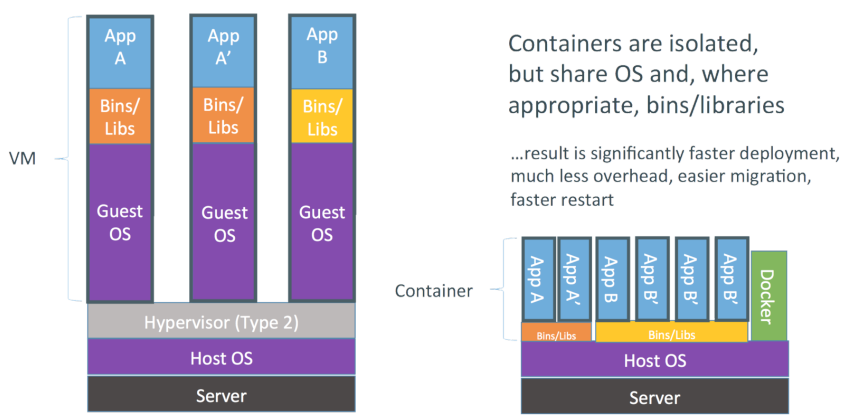
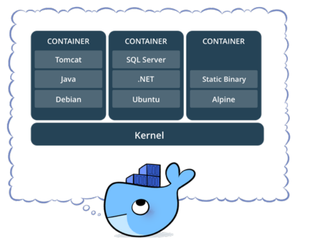
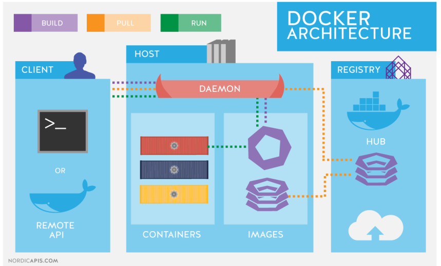

# Curso de Docker

#### O que é Docker?

É uma ferramenta que se apoia em recursos existentes no kernel, inicialmente Linux, para isolar a execução de processos. As ferramentas que o Docker traz são basicamente uma camada de administração de containers, baseado originalmente no LXC.

O Docker é uma plataforma aberta que foi criada com o intuito de facilitar na criação de ambientes, como:

- Agilizar a implementação de novos ambientes
- Auxiliar na criação de aplicações em um ambiente isolado

Com o tempo o Docker foi abraçado pela comunidade graças a:

- Facilidade no gerenciamento
- Agilidade para subir um novo ambiente de desenvolvimento
- A simplicidade de realizar modificações

Tudo isso ajuda muitos desenvolvedores e syadmins no seu dia a dia.

Alguns isolamentos possíveis com o Docker:
- Limites de uso de memória
- Limites de uso de CPU
- Limites de uso de I/O
- Limites de uso de rede
- Isolamento da rede (que redes e portas são acessíveis)
- Isolamento do file system
- Permissões e Políticas
- Capacidades do kernel

Podemos concluir dizendo que estes recursos já existiam no kernel a um certo tempo, o que o Docker nos trouxe foi uma maneira simples e efetiva de utiliza-los.
- https://www.docker.com/what-docker

Containers Docker empacotam componentes de software em um sistema de arquivos completo, que contêm tudo necessário para a execução: código, runtime, ferramentas de sistema - qualquer coisa que possa ser instalada em um servidor.

Isto garante que o software sempre irá executar da mesma forma, independente do seu ambiente.

#### Por que não uma VM?

O Docker tende a utilizar menos recursos que uma VM tradicional, um dos motivos é não precisar de uma pilha completa como vemos em Comparação VMs × Containers. O Docker utiliza o mesmo
kernel do host, e ainda pode compartilhar bibliotecas.

Mesmo utilizando o mesmo kernel é possível utilizar outra distribuição com versões diferentes das bibliotecas e aplicativos.



Figura 1. Comparação VMs × Containers

Virtual Machine (máquina virtual), recurso extremamente usado atualmente para isolamento de serviços, replicação e melhor aproveitamento do poder de processamente de uma máquina física.

Devo trocar então minha VM por um container? Nem sempre, os containers Docker possuem algumas limitações em relação as VMs:
- Todas as imagens são linux, apesar do host poder ser qualquer SO que use ou emule um kernel linux, as imagens em si serão baseadas em linux.
- Não é possível usar um kernel diferente do host, o Docker Engine estará executando sob uma determinada versão (ou emulação) do kernel linux, e não é possível executar uma versão diferente, pois as imagens não possuem kernel.

#### O que são containers?

Container é o nome dado para a segregação de processos no mesmo kernel, de forma que o processo seja isolado o máximo possível de todo o resto do ambiente.

Em termos práticos são File Systems, criados a partir de uma "imagem" e que podem possuir também algumas características próprias.



- https://www.docker.com/what-container

---

#### O que são imagens Docker?

Uma imagem Docker é a materialização de um modelo de um sistema de arquivos, modelo este produzido através de um processo chamado build.

Esta imagem é representada por um ou mais arquivos e pode ser armazenada em um repositório.

**Docker File Systems**

O Docker utiliza file systems especiais para otimizar o uso, transferência e armazenamento das imagens, containers e volumes.

O principal é o AUFS, que armazena os dados em camadas sobrepostas, e somente a camada mais recente é gravável.

AUFS é um unification filesystem. É responsável por gerenciar múltiplos diretórios, empilhá-los uns sobre os outros e fornecer uma única e unificada visão, como se todos juntos fossem apenas um diretório.

Esse único diretório é utilizado para apresentar o container e funciona como se fosse um único sistema de arquivos comum. Cada diretório usado na pilha corresponde a uma camada. E, é dessa forma que o Docker as unifica e proporciona a reutilização entre containeres. Pois, o mesmo diretório correspondente à imagem pode ser montado em várias pilhas de vários containeres.

Com exceção da pasta (camada) correspondente ao container, todas as outras são montadas com permissão de somente leitura, caso contrário as mudanças de um container poderiam interferir em outro. O que, de fato, é totalmente contra os princípios do Linux Container.

Caso seja necessário modificar um arquivo nas camadas (pastas) referentes às imagens, se utiliza a tecnologia Copy-on-write (CoW), responsável por copiar o arquivo para a pasta (camada) do container e fazer todas as modificações nesse nível. Dessa forma, o arquivo original da camada inferior é sobreposto nessa pilha, ou seja, o container em questão sempre verá apenas os arquivos das camadas mais altas.

- Problema com performance

O Docker tira proveito da tecnologia Copy-on-write (CoW) do AUFS para permitir o compartilhamento de imagem e minimizar o uso de espaço em disco. AUFS funciona no nível de arquivo. Isto significa que todas as operações AUFS CoW copiarão arquivos inteiros, mesmo que, apenas pequena parte do arquivo esteja sendo modificada. Esse comportamento pode ter impacto notável no desempenho do container, especialmente se os arquivos copiados são grandes e estão localizados abaixo de várias camadas de imagens. Nesse caso o procedimento copy-on-write dedicará muito tempo para uma cópia interna.

- Volume como solução para performance

Ao utilizar volumes, o Docker monta essa pasta (camada) no nível imediatamente inferior ao do container, o que permite o acesso rápido de todo dado armazenado nessa camada (pasta), resolvendo o problema de performance.

O volume também resolve questões de persistência de dados, pois as informações armazenadas na camada (pasta) do container são perdidas ao remover o container, ou seja, ao utilizar volumes temos maior garantia no armazenamento desses dados.

- Tipos de mount:
    - Bind = As montagens bind são basicamente fazer um vinculo de um determinado diretório ou arquivo do host para dentro do container.
        - Exemplos de montagem bind (bind mount): 
        - docker run -v /<diretório_no_servidor>:/<diretório_no_container> ubuntu
        - docker run -dti --mount type=bind,src=/opt/teste,dst=/teste debian
        - docker run -dti --mount type=bind,src=/opt/teste,dst=/teste,ro debian (o parâmetro "ro" define que este bind será Read-Only)

    - Named = Volumes nomeados são volumes que você cria manualmente com o comando "docker volume create <nome_do_volume>", eles são criados no diretório padrão do docker /var/lib/docker/volumes e podem ser referenciados apenas por nome.
        - Exemplo de criação do volume: docker volume create <nome_do_volume>
        - Exemplo de montagem de volumes
        - docker run -v <nome_do_volume_criado>:/<diretório_no_container> ubuntu (Para volumes Docker apenas)
        - docker run -dti --mount type=volume,src=teste,dst=teste debian (Para volumes Docker ou do Filesystem)

    - Dockerfile volume = Tipo de volume que é criado pela instrução VOLUME no Dockerfile, esses volumes também são criados em /var/lib/docker/volumes, mas não têm um determinado nome. O volume é criado ao executar o container e são úteis para salvar dados persistentes. O desenvolvedor pode dizer onde estão os dados importantes e o que deve ser persistente.

- https://pt.wikipedia.org/wiki/Aufs
- https://docs.docker.com/engine/userguide/storagedriver/aufs-driver/

---

#### Arquitetura do Docker

De maneira simplificada podemos dizer que o uso mais básico do Docker consiste em:
- Ter o serviço Docker Engine rodando
- Ter acesso a API Rest do Docker Engine, normalmente através do Docker Client
- Baixar uma imagem do Docker Registry, normalmente do registry público oficial: https://hub.docker.com
- Instanciar um container a partir da imagem baixada



Figura 2. Arquitetura do Docker

---

#### Instalação do Docker Engine e Docker Machine

O Docker engine pode ser instalado nativamente no Linux ou no sistema operacional Windows atráves da feature WSL.
Para ambientes de laboratório, pode ser usada a opção de instalação chamada Docker Desktop.

- https://github.com/cursodocker2021/curso/blob/main/Instalacao

---

#### Introdução ao Docker Client

Conforme vimos em Arquitetura, o Docker Engine expõe uma API Rest que pode ser consumida pelas mais diversas ferramentas. A ferramenta inicial fornecida com a própria engine é o Docker Client, utilitário de linha de comando.

#### Teste seu Docker com o seguinte comando:

docker container run hello-world

#### Comando run

O comando run é a nossa porta de entrada no Docker, agrupando diversas funcionalidades básicas, como:
- Download automático das imagens não encontradas: docker image pull
- Criação do container: docker container create
- Execução do container: docker container start
- Uso do modo interativo: docker container exec

A partir da versão 1.13, o Docker reestruturou toda a interface da linha de comando, para agrupar melhor os comandos por contexto.

Apesar dos comandos antigos continuarem válidos, o conselho geral é adotar a nova sintaxe.
- https://blog.docker.com/2017/01/whats-new-in-docker-1-13/#h.yuluxi90h1om

Ainda é possível utilizarmos a sintaxe antiga, porém precisamos pensar nela como atalhos:

```
docker pull
    docker image pull
docker create
    docker container create
docker start
    docker container start
docker exec
    docker container exec
```

#### Modo interativo

Podemos usar containers em modo interativo, isto é extremamente útil para processos experimentais, estudo dinâmico de ferramentas e de desenvolvimento.

Exemplos de Uso
- Avaliação do comportamento ou sintaxe de uma versão específica de linguagem.
- Execução temporária de uma distribuição linux diferente
- Execução manual de um script numa versão diferente de um interpretador que não a instalada no host.

Principais opções do Docker para este fim
- docker container run -it
- docker container start -ai
- docker container exec -t

---

#### O container por padrão nasce isolado, mas como vamos usar seus serviços?

Um container normalmente roda com o máximo de isolamento possível do host, este isolamento é possível através do Docker Engine e diversas características provídas pelo kernel.

Mas normalmente não queremos um isolamento total, e sim um isolamento controlado, em que os recursos que o container terá acesso são explicitamente indicados. Principais recursos de controle do isolamento
- Mapeamento de portas
- Mapeamento de volumes
- Copia de arquivos para o container ou a partir do container
- Comunicação entre os containers

#### Mapeamento de portas

É possível mapear tanto portas TCP como UDP diretamente para o host, permitindo acesso através de toda a rede, não necessitando ser a mesma porta do container. O método mais comum para este fim é o parâmetro -p no comando docker container run, o -p recebe um parâmetro que normalmente é composto por dois números separados por : (dois pontos). O primeiro é no host e o segundo é no container

```
# docker container run -p 8080:80 nginx

```

#### Mapeamento de volumes

É possível mapear tanto diretórios no host como entidades especiais conhecidas como volumes para diretórios no container. Por enquanto vamos nos concentrar no mapeamento mais simples, uma diretório no host para um diretório no container. O método mais comum para este fim é o parâmetro -v no comando docker container run, o -v recebe um parâmetro que normalmente é composto por dois caminhos absolutos separados por : (dois pontos). Assim como diversos outros parâmetros, o primeiro é no host e o segundo é no container.

```
# docker container run -p 8080:80 -v $(pwd)/html:/usr/share/nginx/html nginx

```

#### Redes no Docker

O que o docker chama de rede, na verdade é uma abstração criada para facilitar o gerenciamento da comunicação de dados entre containers e os nós externos ao ambiente docker.
O docker é disponibilizado com três redes por padrão. Essas redes oferecem configurações específicas para gerenciamento do tráfego de dados. Para visualizar essas interfaces, basta utilizar o comando abaixo:
```
# docker network ls
```
A redes padrão do Docker são, bridge, none e host.
- Bridge: 
  - Cada container iniciado no docker é associado a uma rede específica. Essa é a rede padrão para qualquer container, a menos que associemos, explicitamente, outra rede a ele. A rede confere ao container uma interface que faz bridge com a interface docker0 do docker host. Essa interface recebe, automaticamente, o próximo endereço disponível na rede IP 172.17.0.0/16.
  - Todos os containers que estão nessa rede poderão se comunicar via protocolo TCP/IP. Se você souber qual endereço IP do container deseja conectar, é possível enviar tráfego para ele. Afinal, estão todos na mesma rede IP (172.17.0.0/16).

- None:
  - Essa rede tem como objetivo isolar o container para comunicações externas. A rede não recebe qualquer interface para comunicação externa. A única interface de rede IP será a localhost.
  - Essa rede, normalmente, é utilizada para containers que manipulam apenas arquivos, sem necessidade de enviá-los via rede para outro local. (Ex.: container de backup utiliza os volumes de container de banco de dados para realizar o dump e, será usado no processo de retenção dos dados).

- Host:
  - Essa rede tem como objetivo entregar para o container todas as interfaces existentes no docker host. De certa forma, pode agilizar a entrega dos pacotes, uma vez que não há bridge no caminho das mensagens. Mas normalmente esse overhead é mínimo e o uso de uma brigde pode ser importante para segurança e gerencia do seu tráfego.

#### Redes definidas pelo usuário

O docker possibilita que o usuário crie redes. Essas redes são associadas ao elemento que o docker chama de driver de rede.

Cada rede criada por usuário deve estar associada a um determinado driver. E, caso você não crie seu próprio driver, deve escolher entre os drivers disponibilizados pelo docker:

 - Bridge:
   - Essa é o driver de rede mais simples de utilizar, pois demanda pouca configuração. A rede criada por usuário utilizando o driver bridge assemelha-se bastante à rede padrão do docker denominada “bridge”.
   - As redes criadas pelo usuário com o driver bridge tem todas as funcionalidades descritas na rede padrão, chamada bridge. Porém, com funcionalidades adicionais.
   - Dentre uma das funcionalidades: a rede criada pelo usuário não precisa mais utilizar a opção antiga “–link”. Pois, toda rede criada pelo usuário com o driver bridge poderá utilizar o DNS interno do Docker que, associa, automaticamente, todos os nomes de containers dessa rede para seus respectivos IPs da rede IP correspondente.
   - Para deixar mais claro: todos os containers que estiverem utilizando a rede padrão bridge não poderão usufruir da funcionalidade de DNS interno do Docker. Caso utilize essa rede, é preciso especificar a opção legada “–link” para tradução dos nomes em endereços IPs dinamicamente alocados no docker.

 - Overlay:
   - O driver overlay permite comunicação entre hosts docker, utilizando-o os containers de um determinado host docker poderão acessar, nativamente, containers de um outro ambiente docker.
   - Esse driver demanda configuração mais complexa, sendo assim, trataremos do detalhamento em outra oportunidade.

Aspectos de redes para compose por exemplo, podem ser acessadas nas referências, assim como comandos especificos de rede estão no documento de comandos.

---

#### Modo daemon

Antes de conhecer opções mais avançadas de compartilhamento de recursos, isolamento, etc, precisamos entender como rodar os containers em background. O parâmetro -d do docker container run indica ao Docker para iniciar o container em background (modo daemon).

Para entender melhor estes containers precisaremos conhecer um novo comando: docker container ps / docker ps -a, que lista containers em execução.

#### Manipulação de containers em modo daemon

Existem diversos comandos que nos ajuda a acompanhar a execução dos containers, entre eles:
- docker container ls
- docker container ls -a
- docker container inspect
- docker container exec
- docker container logs

Vários comandos Docker possuem aliases, por exemplo o container ls tem os seguintes apelidos:
- docker container list
- docker container ps
- docker ps (antiga sintaxe)

#### Nova sintaxe do Docker Client

Agora que já vimos diversos comandos, incluindo tanto a sintaxe nova quanto a velha, podemos entender os principais motivos para esta mudança e a preferência pela nova sintaxe:
- Melhor utilização de comandos similares em contextos diferentes:
  - docker container ls
  - docker image ls
  - docker volume ls
- Maior clareza nos comandos:
  - docker container rm ao invés de docker rm
  - docker image rm ao inveś de docker rmi
  - docker image ls ao invés de docker images
- Mais simplicidade para criação de novos subcomandos
 - Segregação da documentação e helps por contexto

---

#### Criando imagens com Dockerfile

- Quando se utiliza Dockerfile para gerar uma imagem, basicamente, é apresentada uma lista de instruções que serão aplicadas em determinada imagem para que outra imagem seja gerada com base nas modificações.

- Podemos resumir que o arquivo Dockerfile, na verdade, representa a exata diferença entre uma determinada imagem, que aqui chamamos de base, e a imagem que se deseja criar. Nesse modelo temos total rastreabilidade sobre o que será modificado na nova imagem.

Aqui está a lista dos comandos que você pode utilizar dentro do seu arquivo.

- FROM - define a imagem base para você iniciar sua nova imagem.
- LABEL - aqui é possível definir algumas informações para melhor organização de suas imagens, você pode usar quantas labels quiser.
- ENV - variáveis de ambiente que serão utilizadas dentro do container quando você invocar a imagem.
- RUN - aqui irão entrar todos os comandos que deseja executar assim que iniciar a buildar sua imagem.
- WORKDIR - de onde serão executados os comandos, este comando é um path apenas.
- VOLUME - possibilita o acesso de um diretório na sua máquina real.
- USER - qual usuário irá executar os comandos dentro da imagem, o padrão é root.
- ADD or COPY - copia arquivos e diretórios de sua máquina local para dentro da imagem.
- EXPOSE - expõe uma porta para ser acessada publicamente, como a porta 80, por exemplo
- CMD - executa um comando assim que você invocar a imagem.
- ENTRYPOINT - parecido com o CMD, mas aqui normalmente você coloca um script para ser iniciado.

Exemplo de um Dockerfile funcional:

DICA: crie uma pasta para cada Dockerfile e trabalhe dentro dela

```
FROM nginx:latest

LABEL description="Docker imagem que será gerada no nosso exmeplo."
LABEL maintainer="Nome <email@gmail.com>"

ENV VER 1

RUN apt-get update && \
    apt-get install git --yes

ADD index.html /usr/share/nginx/html/index.html

EXPOSE 80

CMD ["nginx", "-g", "daemon off;"]
```

Exemplo de geração de uma imagem nova a partir do Dockerfile (Importante rodar o comando na mesma pasta onde esta o Dockerfile criado):

```
docker build --tag meusite/nginx:0.1 .
```

Exeplo do comando para subir um novo container com a imagem gerada:
```
docker run -dti -p 46000:80 meusite/nginx:0.1 /bin/bash
```

Agora é só abrir no navegador a URL http://localhost:46000 e testar.


Para mais informações sobre Dockerfile consulte o livro de referência: https://github.com/cursodocker2021/curso/blob/main/Referencia

---

#### Docker Compose

Como já conversamos durante o curso, o ideal de um container é que ele seja específico, ou seja, rode apenas o serviço para o qual ele foi desenhado (início do pensamento de micro serviços), porém, as aplicações no geral são compostos por mais de um componente, como por exemplo um serviço de Wordpress, onde temos um servidor (ou container) para a aplicação e um servidor (ou container/serviço PAAS) para o banco de dados, sendo assim, precisamos sair do gerenciamento unitário de containers e avançar para um olhar de serviço.

O Docker compose é uma ferramenta para definir e gerenciar aplicações docker com múltiplos containers utilizando arquivos YAML. Neste contexto, os containers são chamados de serviço. No mesmo arquivo você pode indicar tudo o que você precisa para que sua aplicação funcione, indicando por exemplo a imagem que precisa usar, ou usando o build para indicar um Dockerfile externo que deverá rodar para que o que esta descrito no compose rode.

Exemplo de um arquivo compose:

````
version: '3.8'

networks:
  web_network:
    driver: overlay

volumes:
  site_conf:

services:
  web-server:
    image: httpd:latest
    ports: "80:80"
    deploy:
      placement:
        constraints:
          - "node.role==worker"
      mode: replicated
      replicas: 2
      resource:
        cpus: "0.50"
        memory: 256M
    restart: always
    networks:
      - web_network
    volumes:
      - /dir/site/html:/var/www/html
      - site_conf:/etc/httpd

````
Para instalar o Docker compose utilize a documentação oficial: https://docs.docker.com/compose/install/

---

#### Docker Machine

Docker Machine é a ferramenta que possibilita criar e manter ambientes Docker em máquinas virtuais, ambientes de nuvem e, até mesmo, em máquina física.
- https://docs.docker.com/machine/

---

#### Para mais informações e conceitos avançados do curso, acesse os seguintes links:

Guide linux e livro completo de docker (Usado como referência no curso)
- https://github.com/cursodocker2021/curso/blob/main/Referencia

Referência de comandos mais usados no Docker
- https://github.com/cursodocker2021/curso/blob/main/Comandos
